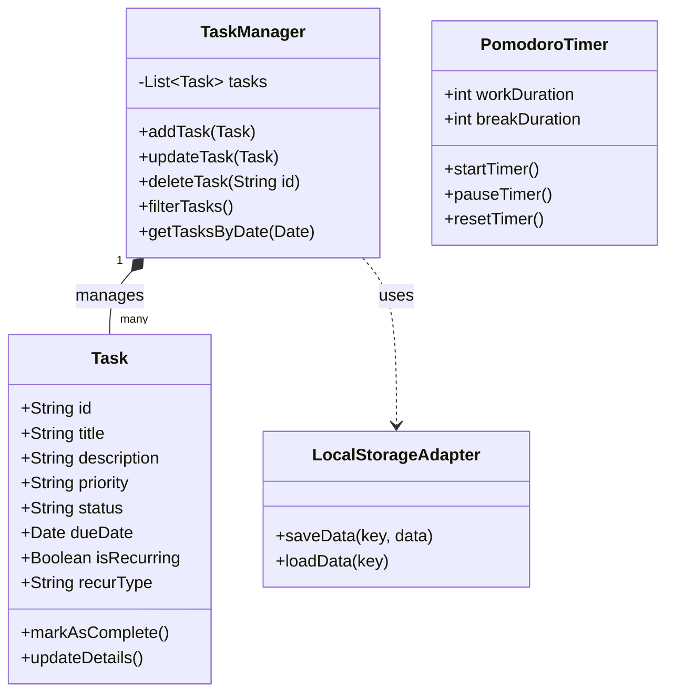

# Báo Cáo Đồ Án Kỹ Thuật Phần Mềm: Hệ Thống Quản Lý Công Việc Cá Nhân

Báo cáo này trình bày quá trình áp dụng Vòng đời Phát triển Phần mềm (SDLC) để xây dựng ứng dụng "Personal Work Manager", đáp ứng các yêu cầu của môn học.

---

## 3.1. Xây dựng ứng dụng
- **Tên ứng dụng:** Personal Work Manager
- **Loại ứng dụng:** Web Application (Single Page Application - SPA)
- **Mục tiêu:** Cung cấp công cụ giúp người dùng cá nhân lập kế hoạch, theo dõi tiến độ công việc, quản lý thời gian bằng Pomodoro và đồng bộ dữ liệu.
- **Chức năng nghiệp vụ chính:** Quản lý CRUD công việc, công việc định kỳ, lịch biểu, Pomodoro timer, và thông báo nhắc nhở.

---

## 3.2. Phân tích & Thiết kế

### 3.2.1. Mô tả yêu cầu phần mềm (Requirements)
- **Yêu cầu chức năng:**
  - Người dùng có thể Thêm, Sửa, Xóa và Cập nhật trạng thái công việc.
  - Phân loại công việc theo mức độ ưu tiên (Cao, Trung bình, Thấp).
  - Hỗ trợ công việc lặp lại (Hàng ngày, Hàng tuần, Hàng tháng).
  - Xem công việc trên lịch biểu.
  - Sử dụng đồng hồ Pomodoro để đếm ngược thời gian làm việc.
  - Nhắc nhở người dùng bằng thông báo (Push Notification).
  - Xuất/Nhập dữ liệu (Backup/Restore).
- **Yêu cầu phi chức năng:**
  - Giao diện thân thiện, hiện đại (UI/UX tốt), hỗ trợ Responsive.
  - Tốc độ phản hồi nhanh, không cần tải lại trang.
  - Dữ liệu được lưu trữ an toàn trên trình duyệt (LocalStorage).

### 3.2.2. Mô hình Use Case (Use Case Diagram)
```mermaid
usecaseDiagram
    actor User
    User --> (Quản lý Công việc)
    User --> (Quản lý Lịch biểu)
    User --> (Sử dụng Pomodoro)
    User --> (Đồng bộ Dữ liệu)
    
    (Quản lý Công việc) ..> (Thêm/Sửa/Xóa Công việc) : include
    (Quản lý Công việc) ..> (Lọc/Tìm kiếm) : include
    (Quản lý Công việc) ..> (Đánh dấu Hoàn thành) : include
    
    (Đồng bộ Dữ liệu) ..> (Nhập dữ liệu .json) : extend
    (Đồng bộ Dữ liệu) ..> (Xuất dữ liệu .json) : extend
```

### 3.2.3. Mô hình Lớp (Class Diagram) - OOP
Mô hình thể hiện cấu trúc dữ liệu và các thực thể chính trong hệ thống:


### 3.2.4. Tư duy thiết kế hướng đối tượng (OOP)
- **Đóng gói (Encapsulation):** Các trạng thái (state) như danh sách công việc, cài đặt hiển thị được đóng gói bên trong `TaskContext`, không bị rò rỉ ra ngoài các component không liên quan. Các hàm CRUD là giao diện duy nhất để tương tác với dữ liệu.
- **Trừu tượng hóa (Abstraction):** Các thao tác tính toán ngày tháng phức tạp (cho công việc định kỳ) được trừu tượng hóa qua các hàm tiện ích (`utils/dateUtils.js`), ẩn đi logic phức tạp đối với UI Component.

---

## 3.3. Thiết kế kiến trúc

### 3.3.1. Lựa chọn kiến trúc
Ứng dụng sử dụng kiến trúc **Client-side Component-Based Architecture** (phù hợp với React), có thể hiểu tương đương với mô hình **MVC** thu gọn ở phía Client:
- **Model:** Cấu trúc dữ liệu Task và LocalStorage, được quản lý thông qua Context API.
- **View:** Các React Components (`components/tasks`, `components/calendar`,...) phụ trách hiển thị dữ liệu ra màn hình và bắt sự kiện của người dùng.
- **Controller:** Các Custom Hooks và hàm xử lý trong `TaskContext` tiếp nhận thao tác từ View, cập nhật Model và kích hoạt View render lại.

### 3.3.2. Design Patterns áp dụng
1. **Context Provider Pattern (Singleton-like):** 
   - Sử dụng `TaskContext` làm Single Source of Truth, cung cấp dữ liệu toàn cục cho mọi Component mà không cần truyền Props lằng nhằng (Prop Drilling).
2. **Observer / State Syncing Pattern:**
   - Dùng `useEffect` trong React để theo dõi sự thay đổi của danh sách (Observer). Mỗi khi `tasks` thay đổi, hệ thống tự động đồng bộ (lưu) xuống `localStorage`.
3. **Strategy Pattern:**
   - Trong quá trình khởi tạo công việc định kỳ, thuật toán tính toán ngày tiếp theo phụ thuộc vào `recurType` (Hàng ngày, Hàng tuần, Hàng tháng). Strategy cho phép chọn thuật toán tính ngày tự động tại runtime.

---

## 3.4. Cài đặt & Triển khai

### 3.4.1. Cài đặt
- **Ngôn ngữ & Thư viện:** JavaScript, React 19, Vite 8.
- **Tổ chức mã nguồn:** Clean Code, chia nhỏ thành các thư mục logic: `components`, `context`, `hooks`, `pages`, `utils`.
- **Giao diện:** Xây dựng Vanilla CSS từ đầu kết hợp các nguyên tắc thiết kế hiện đại (Glassmorphism, mượt mà).

### 3.4.2. Triển khai & Test
- **Triển khai nội bộ (Local):** Chạy lệnh `npm run dev` thông qua Vite cực nhanh.
- **Triển khai Production:** Đóng gói bằng `npm run build` tạo ra thư mục `/dist` gồm HTML/CSS/JS thuần túy, dễ dàng host trên mọi dịch vụ như Vercel, GitHub Pages.
- **Testing:** Đã kiểm thử các luồng (Flow) chính: Thêm công việc, Đánh dấu hoàn thành sinh ra công việc mới (Recurring), và Lưu trữ LocalStorage thành công khi F5 trình duyệt.

---

## 3.5. Đánh giá & Hoàn thiện

### 3.5.1. Nhận xét chất lượng phần mềm
- **Ưu điểm:** 
  - Hoạt động cực kỳ mượt mà nhờ React 19 và Vite.
  - Giao diện đẹp mắt, tạo cảm hứng cho người sử dụng.
  - Chức năng bao quát tốt nhu cầu quản lý công việc và thời gian (Pomodoro).
  - Không yêu cầu backend phức tạp, dữ liệu hoàn toàn thuộc về người dùng (Client-first).
- **Hạn chế:**
  - Do dùng LocalStorage, dữ liệu chỉ tồn tại trên trình duyệt và thiết bị hiện tại, không thể xem chéo thiết bị nếu không dùng tính năng Xuất/Nhập thủ công.

### 3.5.2. Đề xuất cải tiến (Future Work)
1. **Tích hợp Backend/Cloud (BaaS):** Sử dụng Firebase hoặc Supabase để đồng bộ dữ liệu thời gian thực giữa điện thoại và máy tính.
2. **Quản lý Tài khoản (Authentication):** Cho phép người dùng đăng nhập bằng Google/GitHub để lưu trữ công việc cá nhân an toàn hơn.
3. **Mở rộng tính năng làm việc nhóm:** Hỗ trợ chia sẻ công việc (Shared Workspace) cho các nhóm nhỏ, áp dụng mô hình phân quyền cơ bản.
