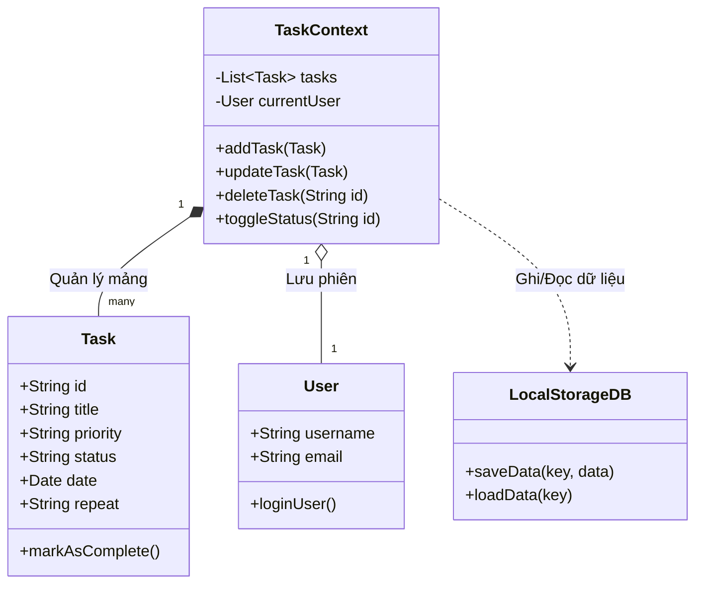
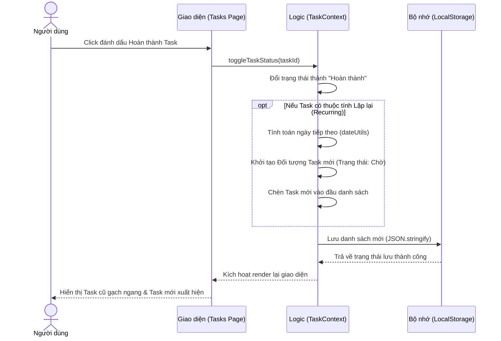
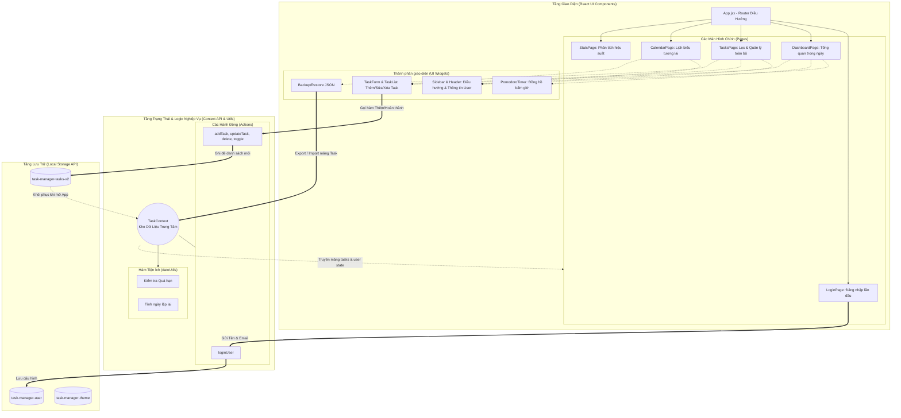

# Các Biểu Đồ UML Hỗ Trợ Báo Cáo Kỹ Thuật Phần Mềm

Tệp này chứa mã nguồn Mermaid của 4 biểu đồ cốt lõi cho dự án **Personal Work Manager**. 
Bạn có thể sao chép các khối mã bên dưới và dán vào [Mermaid Live Editor](https://mermaid.live/) để xuất ra hình ảnh (.png) và chèn vào báo cáo LaTeX.

---

## 1. Biểu đồ Use Case (Use Case Diagram)
**Vị trí chèn:** Phần 2.1.3 trong tệp `sec2_phan_tich_thiet_ke.tex`

```mermaid
usecaseDiagram
    actor User as "Người dùng cá nhân"
    
    rectangle "Hệ thống Personal Work Manager" {
        usecase UC1 as "Quản lý Tài khoản"
        usecase UC2 as "Quản lý Công việc"
        usecase UC3 as "Sử dụng Lịch biểu"
        usecase UC4 as "Thống kê năng suất"
        usecase UC5 as "Đồng bộ/Lưu trữ dữ liệu"
        
        usecase UC2_1 as "Thêm/Sửa/Xóa"
        usecase UC2_2 as "Đánh dấu Hoàn thành"
        
        UC2 ..> UC2_1 : <<include>>
        UC2 ..> UC2_2 : <<include>>
        UC1 <.. UC5 : <<extend>>
    }

    User --> UC1
    User --> UC2
    User --> UC3
    User --> UC4
```

---

## 2. Biểu đồ Lớp (Class Diagram)
**Vị trí chèn:** Phần 2.4 trong tệp `sec2_phan_tich_thiet_ke.tex`



---

## 3. Biểu đồ Tuần tự (Sequence Diagram)
**Vị trí chèn:** Dưới phần Đặc tả Use Case (Phần 2.1.4) trong tệp `sec2_phan_tich_thiet_ke.tex` (Làm rõ luồng sinh công việc lặp lại)



---

## 4. Biểu đồ Kiến trúc Hệ thống (Architecture Diagram)
**Vị trí chèn:** Phần 2.3 trong tệp `sec2_phan_tich_thiet_ke.tex`


  mmmmmmmmmmmmmmmmmm